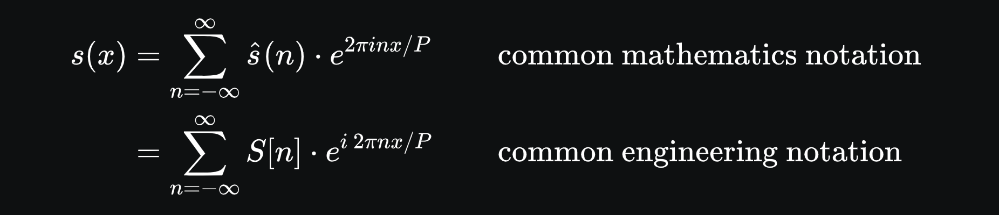
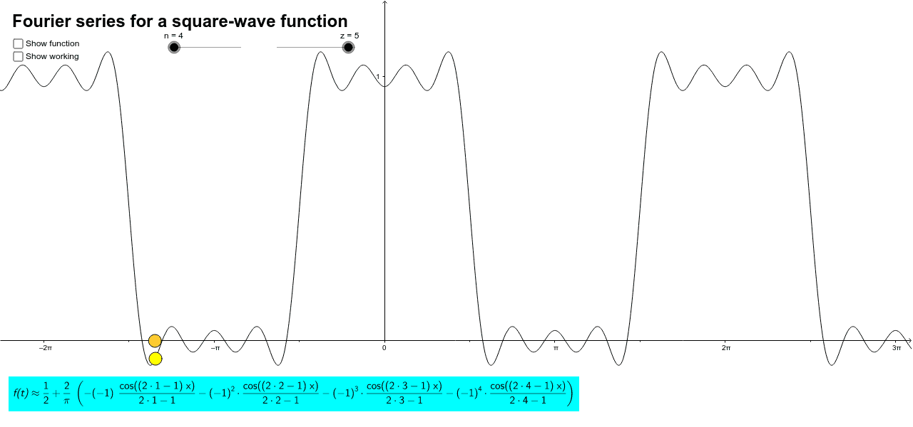
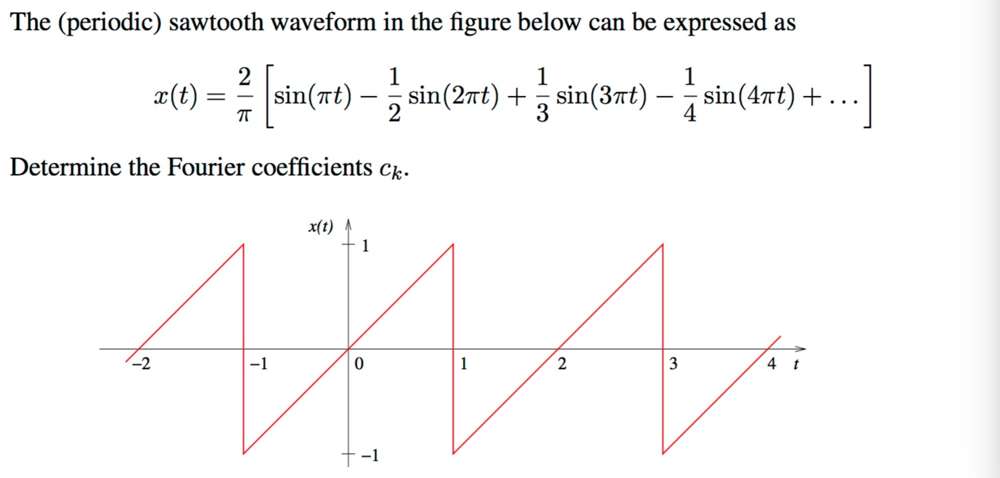

# Fourier Series Animation

This was inspired from [Video](https://www.youtube.com/watch?v=Mm2eYfj0SgA) from [The Coding Train](https://www.youtube.com/@TheCodingTrain).

Wikipedia - [https://en.wikipedia.org/wiki/Fourier_series#Convergence](https://en.wikipedia.org/wiki/Fourier_series#Convergence)

Here a _Square Wave_ and a _Sawtooth Wave_ are implemented.



---

### Square Wave



---

### Sawtooth Wave



### To get started:

Install any static file server like [`live-server`](https://www.npmjs.com/package/live-server) and then in the project directory run:

```sh
$ live-server
```
